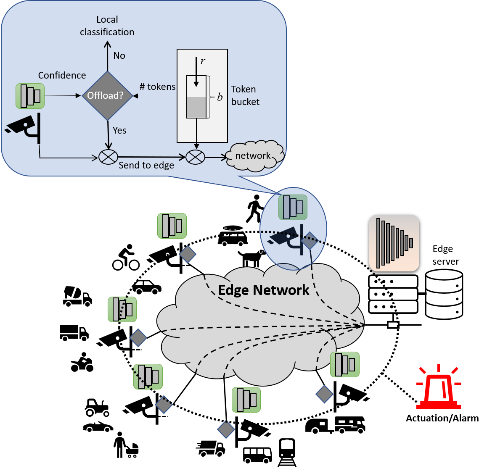

# Adaptive Edge Offloading for Image Classification Under Rate Limit



## Overview

This repository provides a Python implementation for:

Jiaming Qiu, Ruiqi Wang, Ayan Chakrabarti, Roch Guérin, and Chenyang Lu, **"Adaptive Edge Offloading for Image Classification Under Rate Limit"**
[paper]
[slides]
[code]

This work is an extension of **"Real-time Edge Classification: Optimal Offloading under Token Bucket Constraints"**
[[paper]](https://ieeexplore.ieee.org/document/9708981)
[[code]](https://github.com/ayanc/edgeml.mdp)

## Requirements

We recommend a recent Python 3.7+ distribution of [Anaconda](https://www.anaconda.com/products/individual) with `numpy`, `tensorflow 2`, and `matplotlib` installed.

## Reproducing Results

To reproduce the results presented in the paper, you may download and extract our pre-computed [data](https://github.com/qiujiaming315/edgeml-dqn/releases/download/v0.1.0/data.zip) merged from multiple simulations. The files should be extracted into the `viz/data/` sub-directory, which allows you to directly run the note-books in the visualization step.

## Model Training and Simulation

#### Data Preparation

You will need to first download an `npz` [file](https://github.com/qiujiaming315/edgeml-dqn/releases/download/v0.1.0/ofa_top5.npz) containing the pre-computed offloading metrics for the ILSVRC validation set with the weak and strong classifier pair we reported in the paper (VGG-style 16-layer vs. [OFA](https://github.com/mit-han-lab/once-for-all) 595MFlops). You can put the file in the `data/` sub-directory. Check our [previous work](https://github.com/ayanc/edgeml.mdp) for more details on computing offloading metrics with your own dataset and classifier pair.

#### Training

`train.py` in the root directory is the main script for training the DQN model. Here is a typical example run:
  
``` shell
# Start running 3k Q-value iterations with a learning rate of 10^-3.
./train.py data/ofa_top5.npz wts --tr 0.25 --tb 2 --stype 1 --itype 1 --lr 3 --maxiter 3000
# Reward and loss have saturated. Drop the learning rate to 10^-4 and run another 1k iterations.
./train.py data/ofa_top5.npz wts --tr 0.25 --tb 2 --stype 1 --itype 1 --lr 4 --maxiter 4000
```

Running the script with `-h` gives you a detailed list of parameters.

#### Simulation

After you trained the DQN model, weights are stored in the specified directory (`wts/` in the above example). The model is then ready for simulation on the test sequences with `simulate.py`. Make sure you point the script to the right directory to load the model and use consistent token bucket and sequence configurations throughout training and simulation. For example, to run simulation with the model trained above, you should use:

``` shell
# Set the model directory to wts/ and use the same configuration.
./simulate.py data/ofa_top5.npz wts save --tr 0.25 --tb 2 --stype 1 --itype 1
```

The simulation results (Average loss of the DQN, MDP, Baseline and Lower Bound policies, as well as that of the weak and strong classifiers) are stored in the specified directory (`save/` in the above example). You can compare the performance of different policies, or the performance of the same policy accorss different configurations by training DQN models and running simulations accorss these configurations.

#### Library

The actual library for loading data, generating sequences, computing policies and simulations is in the [lib](lib/) directory. Please take a look at its [README.md](lib/README.md) file for documentation.

## Visualization

We provide separate jupyter notebooks in `viz/notebook/` to visualize (either downloaded or generated) results, producing the figures included in the paper.

## License

This code is being released under the [MIT License](LICENSE). Note that the offloading metrics are computed following the procedure developed in our [previous work](https://github.com/ayanc/edgeml.mdp), and the OFA results files were generated from the [models and code](https://github.com/mit-han-lab/once-for-all) provided by its authors.

## Acknowledgments

This work was partially supported by the National Science Foundation under grants no. CPS-1646579 and CNS-2006530, and the Fullgraf Foundation. Any opinions, findings, and conclusions or recommendations expressed in this material are those of the authors, and do not necessarily reflect the views of the National Science Foundation and the Fullgraf Foundation.

Ayan Chakrabarti extensively contributed to this implementation by collaborating with Jiaming Qiu.
